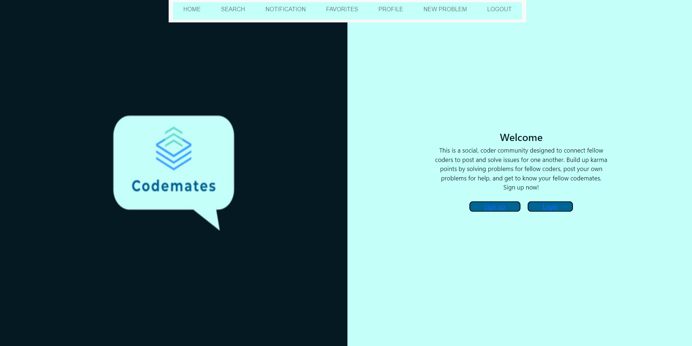

# Codemates

## Description 

Our motivation for creating this project was to showcase our programming skills throughout the bootcamp and use what we learned to create a fully functional real-world application. In th eprocess of creating this application we have better learned how to use all the technologies and skills provided to us and also learned how to piece them all together into a functional full stack application.

## Built With

  [](https://reactjs.org/) [](https://graphql.org/) [](https://mongoosejs.com/) [](https://www.mongodb.com/) [](http://expressjs.com/) [](https://www.heroku.com/what) [](https://nodejs.org/en/) [](https://www.npmjs.com/) [](https://developer.mozilla.org/en-US/docs/Web/JavaScript)  [](https://developer.mozilla.org/en-US/docs/Glossary/HTML5) [](https://developer.mozilla.org/en-US/docs/Web/CSS) [](https://getbootstrap.com/)

 
## Table of Contents
 
- [Installation](#installation)
- [Usage](#usage)
- [Credits](#credits)
- [Features](#features)
- [Questions](#questions)
- [Tests](#tests) 

##  Installation 

```npm install``` ```npx creat-react-app my-app``` ```npm run build``` 

## Usage 

Please visit the deployed application at https://codemates-app.herokuapp.com/

This is a continual work in progress

 

## Credits / Contributors 

This is still a work in progress being created by : 

[MariaYConstanza](https://github.com/MariaYConstanza) 

[jalmand2](https://github.com/jalmand2) 

[Zechariahmn](https://github.com/Zechariahmn) 

[Tab-Y](https://github.com/Tab-Y/) 


## Questions 

If you have any questions or concerns, please reach out to any of the contibutors.
